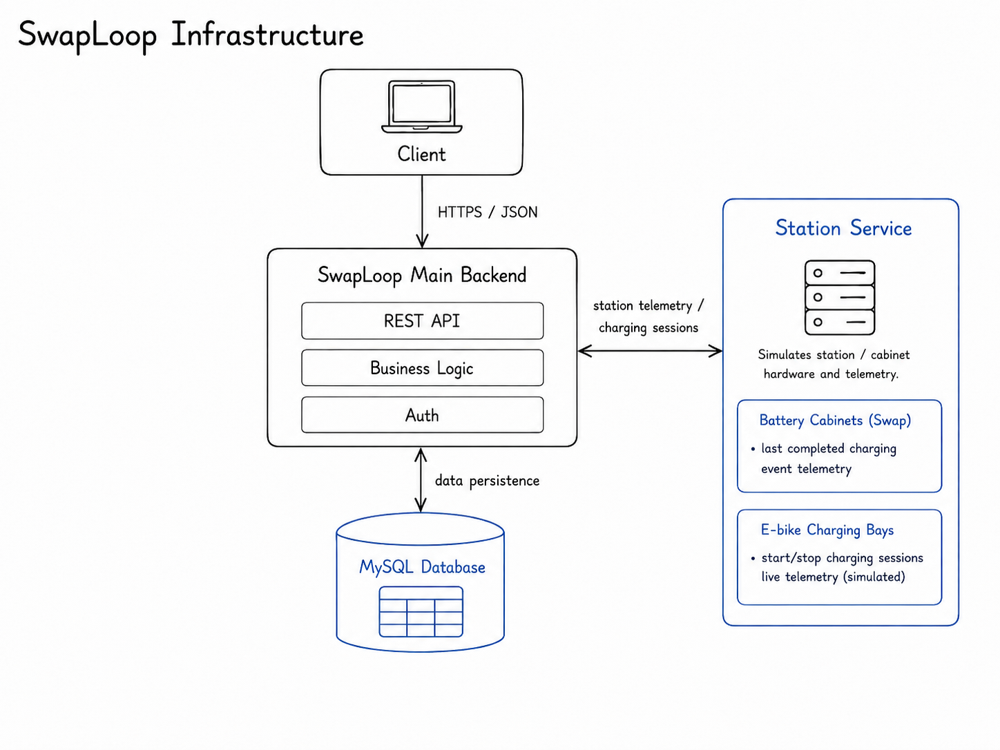
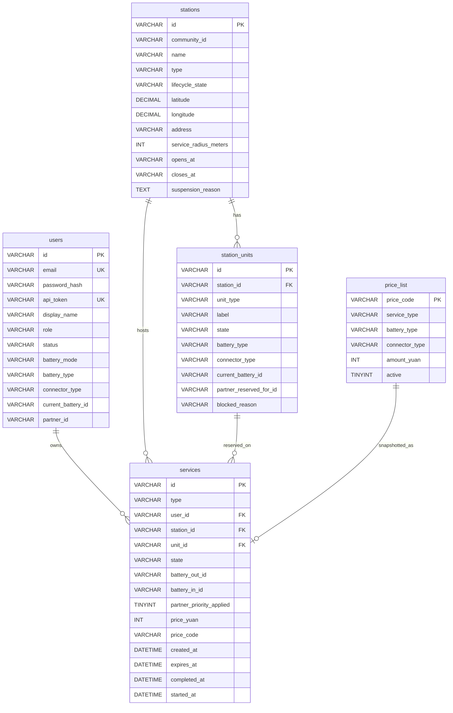

# Test Project Outline – Module C – SwapLoop REST API Backend

## Competition time

Competitors will have **3 hours** to complete this module.

## Introduction

**SwapLoop** is a fictional Shanghai community pilot offering safer alternatives to charging e-bike batteries indoors. **SwapLoop Stations** across the city let riders exchange compatible removable batteries from a **battery slot**, or charge e-bikes with integrated batteries in a monitored **e-bike charging bay**. Some stations offer only battery slots (`SWAP`) or charging bays (`CHARGING`); **hybrid** stations (`HYBRID`) offer both.

In **Module C**, competitors build a **working prototype** of the **Main Backend**—a deterministic REST API consumed by the Module D SPA. Business rules for eligibility, reservation integrity, last-charge quarantine, live charging simulation orchestration, and pay-as-you-go price snapshots are implemented here.

In the overall structure, there is a **Station Service**: a separate technical edge service that stands in for station / cabinet hardware and telemetry. **Station Service** simulates last completed charging-event telemetry for swappable battery packs, and simulated e-bike charging sessions. It is provided for this module. Station Service APIs are **unprotected** (no authentication) and the **Main Backend** is the only application that should call it. (In the intended final setup it is reachable from the Main Backend over a secure private network link, so public clients never see it.)



Real payments, physical lock control, IoT devices, QR scanning / deep-link handling (Module D), monthly subscriptions, and fleet settlement are **out of scope**.

## General Description of Project and Tasks

Implement an independently runnable Main Backend so that later frontend modules can use it without reproducing backend business rules. The following is a high-level overview; detailed specifications are in the [Requirements](#requirements) section:

- implement authentication and authorization (opaque bearer tokens)
- implement error handling with consistent machine-readable codes
- serve station discovery (list, filters, detail, compatibility, optional rider availability)
- implement unified **services** for swap and charging (short holds and state machines)
- enforce last-charge safety via Station Service before swap reservation
- start Station Service bike-bay charging sessions and expose their telemetry
- snapshot pay-as-you-go prices on confirm/collect and expose the price catalog
- restore the canonical seed via reset

### Environment and provided assets

Build the API with a server-side language and framework available in the competition environment.

- Use **MySQL** for persistence. Import [`assets/db/swaploop_db.sql`](./assets/db/swaploop_db.sql) .
- Implement the API according to [`assets/api/main-backend.openapi.yaml`](./assets/api/main-backend.openapi.yaml). That document is the authoritative contract for paths, requests, responses, security, and errors. Offline Swagger UI: [`assets/api/main-backend-docs/index.html`](./assets/api/main-backend-docs/index.html).
- A Bruno / OpenCollection suite for the **Main Backend** is provided under [`assets/bruno/main-backend`](./assets/bruno/main-backend).
- Call the provided **Station Service** at `https://cXX-YYYY-station-service.sitc.skillsit.eu` (replace `cXX` / `YYYY` with your competition username and PIN). Its API is unprotected; only your Main Backend should use it. See [`assets/api/station-service-openapi.yaml`](./assets/api/station-service-openapi.yaml), the offline Swagger UI at [`assets/api/station-service-docs/index.html`](./assets/api/station-service-docs/index.html), and the Station Service Bruno suite under [`assets/bruno/station-service`](./assets/bruno/station-service).

All Main Backend API paths in this document are relative to `/api/v1` on whatever host you run (for example `POST /auth/login` means `POST {baseUrl}/api/v1/auth/login`). Use your local development URL while building; during assessment, the deployed Main Backend is available at `https://cXX-YYYY-module-c.sitc.skillsit.eu` (replace `cXX` / `YYYY` with your competition username and PIN).

### Vehicle profiles and compatibility

Currently, there are only two supported swappable battery types and two supported integrated connector types for e-bikes with integrated batteries.

| `batteryMode` | Battery / Connector Types |
| ------------- | ------------------------- |
| `SWAPPABLE`   | `SL-48` \| `SL-60`        |
| `INTEGRATED`  | `GB-AC-48` \| `GB-AC-60`  |

`voltageClass` (`48V` / `60V`) is **derived** from the chosen type; it is not a separate stored column.

### Authentication and authorization

The Main Backend uses **opaque** bearer tokens. Store each token in the `api_token` column of the `users` table (no sessions table, no JWT).

1. `POST /auth/login` and `POST /auth/register` verify or create the user and return `{ "token": "..." }` only.
2. Clients send `Authorization: Bearer <token>` on protected routes.
3. On each protected request, look up the user whose `api_token` column matches that bearer token.
4. Missing or unknown token → `401 UNAUTHORIZED`.
5. Suspended accounts cannot log in and cannot call protected routes → `403 FORBIDDEN`.
6. Self-registration creates `RIDER` / `ACTIVE` only.

Plaintext password for all seeded users: `password123`.

| Bearer token       | Actor       | Role    | Status      | Profile               |
| ------------------ | ----------- | ------- | ----------- | --------------------- |
| `sl_tok_rider-001` | `rider-001` | `RIDER` | `ACTIVE`    | SWAPPABLE / SL-48     |
| `sl_tok_rider-002` | `rider-002` | `RIDER` | `ACTIVE`    | INTEGRATED / GB-AC-48 |
| `sl_tok_rider-003` | `rider-003` | `RIDER` | `ACTIVE`    | SWAPPABLE / SL-48     |
| `sl_tok_rider-006` | `rider-006` | `RIDER` | `SUSPENDED` | INTEGRATED / GB-AC-60 |

Example:

```http
Authorization: Bearer sl_tok_rider-001
```

### Unified services (swap and charging)

One `services` row owns the full lifecycle (`type` `SWAP` \| `CHARGING` plus type-specific `state`).

- Create hold: `POST /services` with `{ type, stationId }` → `RESERVED` with `expiresAt` = now + **10 seconds**. _(Competition / marking duration only — a production system would use a much longer hold, typically 15–30 minutes.)_
- Expiry is **not** applied inside `POST /services` itself. Later endpoints that act on a `RESERVED` hold (for example `POST /services/:serviceId/start`) must compare `expiresAt` to the current time; if the hold is overdue, set the service to `EXPIRED` and return the unit (`SWAP_BAY`: `RESERVED` → `READY`; `BIKE_BAY`: `RESERVED` → `AVAILABLE`), then reject the action with `409`.
- One active service per rider (`409` if another is active). Overdue `RESERVED` holds must not block a new create once they have been expired.
- Transitions are safe to retry: if a transition already succeeded, calling it again returns the current service and must not apply the change a second time.
- Client never supplies business timestamps or prices.

**Swap states:** `RESERVED` → `STARTED` (`/start`) → `CONFIRMED` (`/confirm`). Cancel from `RESERVED` or `STARTED`.

**Charging states:** `RESERVED` → `CHARGING` (`/start`) → `READY_FOR_COLLECTION` (auto via `/charging-status`) → `COLLECTED` (`/collect`). Cancel only from `RESERVED`.

### Battery safety via Station Service

Before offering or reserving a swappable pack, the Main Backend must call Station Service:

```http
GET {STATION_SERVICE}/api/batteries/{batteryId}/last-charging-telemetry
```

Station Service returns raw samples only (`time`, `temperature`, `chargingVoltage`). **Quarantine decisions belong to the Main Backend.** Station Service does not quarantine packs.

Refuse the pack (quarantine the bay / return `409 CONFLICT`) if **either** rule fails:

1. **Spike** — any sample has `temperature > 55`.
2. **Sustained heat** — a contiguous sample sequence where `time(last) − time(first) ≥ 5 minutes` and the arithmetic mean of those temperatures is `> 50`. A single hot reading alone does not satisfy Rule 2.

A known battery with empty samples → Station Service `404 NO_TELEMETRY`. Do **not** treat that as healthy. Unsafe or `NO_TELEMETRY` packs must not be offered for swap.

Seeded fixtures:

| `batteryId`                        | Expected outcome                |
| ---------------------------------- | ------------------------------- |
| `battery-001`                      | Safe — reservation allowed      |
| `battery-005`                      | Spike — quarantine / refuse     |
| `battery-007`                      | Sustained — quarantine / refuse |
| `battery-002`, `003`, `006`, `010` | `NO_TELEMETRY` — refuse         |

Optional helper on the Main Backend: `POST /batteries/{id}/evaluate-last-charge` (same rules as inline reservation checks).

### Live bike-bay charging via Station Service

When a rider starts a `CHARGING` service, the Main Backend must start a Station Service session:

```http
POST   {STATION_SERVICE}/api/bike-bays/{unitId}/charging/sessions
GET    {STATION_SERVICE}/api/bike-bays/{unitId}/charging/sessions/current
DELETE {STATION_SERVICE}/api/bike-bays/{unitId}/charging/sessions/current
```

Behaviour:

- The session lasts about **15 seconds** and emits synthetic samples (`socPercent`, `chargingPowerKw`, `temperature`).
- If Station Service cannot start the session, the Main Backend **fails closed**: leave the hold `RESERVED` and return `502` / `409` as appropriate.
- The SPA polls Main Backend `GET /services/{id}/charging-status` (not Station Service directly). That endpoint proxies Station Service telemetry.
- When Station Service reports `COMPLETED` and the service is still `CHARGING`, the Main Backend auto-transitions to `READY_FOR_COLLECTION`.
- On `collect`, clear the Station Service session best-effort (`DELETE …/charging/sessions/current`).

### Pay-as-you-go pricing and receipts

Competition scope is **pay-as-you-go only**. Real Alipay debit is TBD.

| Service      | Key                     | Amount (CNY) | `price_code`      |
| ------------ | ----------------------- | ------------ | ----------------- |
| Battery swap | `SWAP` + `SL-48`        | 5            | `SWAP_SL-48`      |
| Battery swap | `SWAP` + `SL-60`        | 7            | `SWAP_SL-60`      |
| E-bike bay   | `CHARGING` + `GB-AC-48` | 3            | `CHARGE_GB-AC-48` |
| E-bike bay   | `CHARGING` + `GB-AC-60` | 4            | `CHARGE_GB-AC-60` |

On successful swap **confirm** or charging **collect**, look up the matching active row in the `price_list` table from the rider’s `batteryType` / `connectorType`, and in the same transaction copy the amounts into the service row’s `price_yuan` and `price_code` columns (JSON responses expose these as `priceYuan` / `priceCode`). Receipts use those snapshotted service fields. Optional catalog: `GET /price-list`.

### Database structure

Competitors must use the supplied dump. Do **not** invent a parallel schema that breaks the OpenAPI contract. The competition seed uses these tables:



#### Table descriptions

| Table             | Description                                                                                           |
| ----------------- | ----------------------------------------------------------------------------------------------------- |
| **users**         | Riders. Opaque `api_token`. Mode-driven vehicle profile. SWAPPABLE riders track `current_battery_id`. |
| **stations**      | Discoverable locations (`SWAP` / `CHARGING` / `HYBRID`) with lifecycle and geo fields.                |
| **station_units** | `SWAP_BAY` (Battery Slot) or `BIKE_BAY` (E-bike Charging Bay) with state and compatibility fields.    |
| **services**      | Single lifecycle row for swap or charging; price snapshot columns filled at finish.                   |
| **price_list**    | Active PAYG catalog in whole CNY.                                                                     |

### Technical constraints

- Return JSON for all normal and error responses.
- Use `Asia/Shanghai` as the business timezone. Return timestamps as ISO 8601 strings with an explicit offset.
- Real payment processing, real IoT integration, route optimization, native mobile apps, machine learning, and battery chemistry simulation are out of scope.

## Requirements

The Main Backend shall implement the behaviours below. All routes, request bodies, responses, and errors must conform to [`assets/api/main-backend.openapi.yaml`](./assets/api/main-backend.openapi.yaml).

**Important:** Do **not** reimplement Station Service routes inside the Main Backend. Call the provided Station Service for last-charge telemetry and live bike-bay sessions as specified in [Battery safety via Station Service](#battery-safety-via-station-service) and [Live bike-bay charging via Station Service](#live-bike-bay-charging-via-station-service).

**Database:** Import [`assets/db/swaploop_db.sql`](./assets/db/swaploop_db.sql). Competitors must not change the seed identifiers required by assessment.

### Error Handling

Endpoints must return an appropriate HTTP status with a JSON object containing at least a machine-readable `code` and a human-readable `message`:

| Status | When to use                                                                               |
| ------ | ----------------------------------------------------------------------------------------- |
| `401`  | Missing or invalid authentication                                                         |
| `403`  | Suspended account, failed ownership, or forbidden action                                  |
| `404`  | Unknown resource where disclosure is safe                                                 |
| `409`  | Reservation collisions, invalid state transitions, active-service conflicts, unsafe packs |
| `422`  | Syntactically valid requests that fail validation or compatibility rules                  |
| `502`  | Upstream Station Service failure when fail-closed behaviour applies                       |
| `5xx`  | Unexpected server failures only                                                           |

Example:

```json
{
  "code": "CONFLICT",
  "message": "You already have an active service."
}
```

### Endpoints to be implemented on the Main Backend

#### General rules for the API

- Dynamic data must come from MySQL (and Station Service where specified).
- Placeholder parameters in the URL are marked with a preceding colon (e.g. `:stationId`).
- Property order in objects does not matter; array order matters where specified (e.g. nearest-first stations).
- `Content-Type` of JSON responses is `application/json`.
- Paths below are relative to `/api/v1`.
- Unless marked public, endpoints require a valid Bearer token.

---

#### Health

##### GET /health

Public liveness probe. No authentication required.

**Response:** `200 OK`

```json
{
  "status": "ok"
}
```

#### Authentication

##### POST /auth/login

Public. Verifies email + password against bcrypt `password_hash`. Returns the user’s opaque `api_token`.

**Request example:**

```json
{
  "email": "lin.xiaoyu@swaploop.test",
  "password": "password123"
}
```

**Response:** `200 OK`

```json
{
  "token": "sl_tok_rider-001"
}
```

**Error responses (examples):** `401` (`UNAUTHORIZED`), `403` (`FORBIDDEN` for suspended), `422` (`VALIDATION_ERROR`).

---

##### POST /auth/register

Public. Creates a `RIDER` / `ACTIVE` account with a mode-driven vehicle profile and returns a new opaque token.

**Request example (swappable):**

```json
{
  "email": "new.rider@swaploop.test",
  "password": "password123",
  "displayName": "New Rider",
  "batteryMode": "SWAPPABLE",
  "batteryType": "SL-48"
}
```

**Request example (integrated):**

```json
{
  "email": "charge.rider@swaploop.test",
  "password": "password123",
  "displayName": "Charge Rider",
  "batteryMode": "INTEGRATED",
  "connectorType": "GB-AC-48"
}
```

**Response:** `201 Created`

```json
{
  "token": "sl_tok_rider-xxxxxxxx"
}
```

**Behaviour (summary):**

- `SWAPPABLE` requires `batteryType`; omit `connectorType`; assign an initial `current_battery_id` for the new rider.
- `INTEGRATED` requires `connectorType`; omit `batteryType`; `current_battery_id` stays null.
- Reject invalid mode/type combinations with `422`.
- Duplicate email → `409`.

---

#### Current rider

##### GET /me

Protected. Returns the authenticated public profile (no password or token). Includes derived `voltageClass`.

**Response:** `200 OK`

```json
{
  "id": "rider-001",
  "email": "lin.xiaoyu@swaploop.test",
  "displayName": "Lin Xiaoyu",
  "role": "RIDER",
  "status": "ACTIVE",
  "batteryMode": "SWAPPABLE",
  "batteryType": "SL-48",
  "connectorType": null,
  "voltageClass": "48V",
  "currentBatteryId": "battery-101",
  "partnerId": null
}
```

**Error responses (examples):** `401` (`UNAUTHORIZED`), `403` (`FORBIDDEN`).

---

##### PATCH /me

Protected. Partial update of `displayName` and/or vehicle profile (same validation rules as register).

**Response:** `200 OK` — updated public user object.

**Error responses (examples):** `422` (`VALIDATION_ERROR`), `401`, `403`.

---

##### GET /me/activity

Protected. Returns the rider’s Activity snapshot for the SPA:

- **`active`** — the current in-progress service, or `null` if none. Active means non-terminal states (`RESERVED`, `STARTED`, `CHARGING`, `READY_FOR_COLLECTION`). If the only candidate is `RESERVED` with `expiresAt` ≤ now, expire it first (service → `EXPIRED`; `SWAP_BAY`: `RESERVED` → `READY`; `BIKE_BAY`: `RESERVED` → `AVAILABLE`) and return `"active": null`.
- **`recent`** — up to **5** of the rider’s services in a **terminal** state (`CONFIRMED`, `COLLECTED`, `EXPIRED`, `CANCELLED`, `SAFETY_CUTOFF`), newest first (order by `completedAt`, then `expiresAt`, then `createdAt`). This is a count limit, not a time window.

**Response:** `200 OK`

```json
{
  "active": {
    "id": "service-ab12cd34",
    "type": "SWAP",
    "riderId": "rider-001",
    "stationId": "station-001",
    "unitId": "unit-001",
    "state": "RESERVED",
    "batteryOutId": "battery-001",
    "batteryInId": null,
    "priceYuan": null,
    "priceCode": null,
    "partnerPriorityApplied": false,
    "createdAt": "2026-08-15T12:00:00.000+08:00",
    "expiresAt": "2026-08-15T12:00:10.000+08:00",
    "startedAt": null,
    "completedAt": null,
    "timestamp": "2026-08-15T12:00:00.000+08:00"
  },
  "recent": [
    {
      "id": "service-9f81e2c0",
      "type": "SWAP",
      "riderId": "rider-001",
      "stationId": "station-002",
      "unitId": "unit-008",
      "state": "CONFIRMED",
      "batteryOutId": "battery-010",
      "batteryInId": "battery-101",
      "priceYuan": 5,
      "priceCode": "SWAP_SL-48",
      "partnerPriorityApplied": false,
      "createdAt": "2026-08-14T18:00:00.000+08:00",
      "expiresAt": "2026-08-14T18:00:10.000+08:00",
      "startedAt": "2026-08-14T18:00:02.000+08:00",
      "completedAt": "2026-08-14T18:00:05.000+08:00",
      "timestamp": "2026-08-14T18:00:05.000+08:00"
    }
  ]
}
```

When there is no active service and no history, return `"active": null` and `"recent": []`. Finished services include snapshotted `priceYuan` / `priceCode` when priced.

---

#### Stations

##### GET /stations

Public. Optional bearer token adds per-station `riderAvailability`.

**Query parameters:**

| Param           | Notes                                                                               |
| --------------- | ----------------------------------------------------------------------------------- |
| `lat`, `lng`    | Nearby filter (both required together). Adds `distanceMeters`, sorts nearest-first. |
| `radiusMeters`  | Optional; default `1500` when lat/lng present                                       |
| `type`          | `SWAP` \| `CHARGING` \| `HYBRID`                                                    |
| `service`       | `SWAP` \| `BIKE_BAY` — compatibility / availability filter                          |
| `batteryType`   | With `service=SWAP`: `SL-48` \| `SL-60`                                             |
| `connectorType` | With `service=BIKE_BAY`: `GB-AC-48` \| `GB-AC-60`                                   |

Suspended stations remain discoverable in unfiltered lists but must not offer reservable capacity when `service` filters are applied.

**Response:** `200 OK`

```json
{
  "stations": [
    {
      "id": "station-001",
      "name": "Haitang Garden East Gate",
      "type": "HYBRID",
      "lifecycleState": "ACTIVE",
      "latitude": 31.2308,
      "longitude": 121.4717,
      "address": "88 Haitang Community Road",
      "compatibility": {
        "services": ["SWAP", "BIKE_BAY"],
        "batteryTypes": ["SL-48", "SL-60"],
        "connectorTypes": ["GB-AC-48"],
        "voltageClasses": ["48V", "60V"]
      }
    }
  ]
}
```

With bearer token, each station may also include:

```json
"riderAvailability": {
  "compatibleReadyBattery": true,
  "compatibleChargingBay": false
}
```

---

##### GET /stations/:stationId

Public. Station detail with compatibility. Optional bearer adds `riderAvailability`.

**Response:** `200 OK` — station object as above (single resource, not wrapped in `stations`).

**Error responses (examples):** `404` (`NOT_FOUND`).

---

#### Services

##### POST /services

Protected. Creates a **10-second** `RESERVED` hold so expiry can be tested during marking. A real-world deployment would use a much longer hold (typically **15–30 minutes**); implement the competition duration of **10 seconds**.

**Behaviour (summary):**

- `SWAP`: rider must be `SWAPPABLE` with `batteryType`. Atomically reserve one READY matching `SWAP_BAY`. Before accepting a pack, evaluate last-charge telemetry; quarantine/skip unsafe or `NO_TELEMETRY` packs and try the next candidate.
- `CHARGING`: rider must be `INTEGRATED` with `connectorType`. Atomically reserve one AVAILABLE matching `BIKE_BAY`.
- One active service per rider. Before enforcing that rule, expire any of the rider’s overdue `RESERVED` holds (`expiresAt` ≤ now → service `EXPIRED`; `SWAP_BAY`: `RESERVED` → `READY`; `BIKE_BAY`: `RESERVED` → `AVAILABLE`) so a timed-out hold does not block a new create.
- Set `expiresAt` to **now + 10 seconds** on the created service. (Later actions such as `POST /services/:serviceId/start` check `expiresAt`.)

**Request example:**

```json
{
  "type": "SWAP",
  "stationId": "station-001"
}
```

**Response:** `201 Created` — Service object, for example:

```json
{
  "id": "service-ab12cd34",
  "type": "SWAP",
  "riderId": "rider-001",
  "stationId": "station-001",
  "unitId": "unit-001",
  "state": "RESERVED",
  "batteryOutId": "battery-001",
  "batteryInId": null,
  "priceYuan": null,
  "priceCode": null,
  "createdAt": "2026-08-15T12:00:00.000+08:00",
  "expiresAt": "2026-08-15T12:00:10.000+08:00",
  "startedAt": null,
  "completedAt": null
}
```

**Error responses (examples):** `422` (wrong vehicle profile), `409` (no capacity / active service / all packs unsafe), `401`, `403`.

---

##### GET /services/:serviceId

Protected. Owner only may read the service.

**Response:** `200 OK` — Service object.

**Error responses (examples):** `404`, `403`, `401`.

---

##### POST /services/:serviceId/start

Protected. Owner only.

- If the service is still `RESERVED` and `expiresAt` ≤ now: set the service to `EXPIRED`, return the unit (in the `station_units` table: `SWAP_BAY`: `RESERVED` → `READY`; `BIKE_BAY`: `RESERVED` → `AVAILABLE`), and return `409` (hold expired). Do not start an overdue hold.
- **SWAP:** `RESERVED` → `STARTED` (simulated locker open). If the service is already `STARTED`, return it unchanged with `200` (do not fail and do not start again).
- **CHARGING:** call Station Service `POST {STATION_SERVICE}/api/bike-bays/{unitId}/charging/sessions` using the service’s reserved `unitId`. On success, set the service `RESERVED` → `CHARGING` and record `startedAt`. If Station Service fails (network error, non-success status, or cannot create the session), leave the service `RESERVED`, do not change the bay, and return `502` or `409` as appropriate. If the service is already `CHARGING`, return it unchanged with `200` (do not start a second Station Service session).

**Response:** `200 OK` — updated Service.

**Error responses (examples):** `409` (expired hold or invalid state), `403`, `401`, `404`.

---

##### GET /services/:serviceId/charging-status

Protected. Owner only. For `CHARGING` services. This is the endpoint that exposes live bike-bay charging telemetry to the SPA. Poll about once per second while the service is `CHARGING`.

**Behaviour (summary):**

- Call Station Service `GET {STATION_SERVICE}/api/bike-bays/{unitId}/charging/sessions/current` using the service’s `unitId`.
- Return `{ service, charging }` where `charging` includes at least `status` (`CHARGING` \| `COMPLETED`), `startedAt`, `endsAt`, and `samples` (`socPercent`, `chargingPowerKw`, `temperature`) from Station Service.
- When Station Service reports `COMPLETED` and the service is still `CHARGING`, auto-transition the service (and unit) to `READY_FOR_COLLECTION` before responding.

**Response:** `200 OK`

```json
{
  "service": {
    "id": "service-ab12cd34",
    "type": "CHARGING",
    "state": "CHARGING"
  },
  "charging": {
    "status": "CHARGING",
    "startedAt": "2026-08-15T12:01:00.000+08:00",
    "endsAt": "2026-08-15T12:01:15.000+08:00",
    "samples": [
      {
        "socPercent": 42,
        "chargingPowerKw": 1.2,
        "temperature": 31.5
      }
    ]
  }
}
```

**Error responses (examples):** `409` (service not in a charging lifecycle state), `403`, `401`, `404`, `502` (Station Service unavailable).

---

##### POST /services/:serviceId/confirm

Protected. Owner only. Swap only: `STARTED` → `CONFIRMED`.

**Behaviour (summary):**

- Inventory exchange: bay goes `CHARGING` holding the rider’s previous pack (`batteryInId`); rider `currentBatteryId` becomes `batteryOutId`.
- Snapshot PAYG `priceYuan` / `priceCode` from `price_list` (e.g. SL-48 → `5` / `SWAP_SL-48`).
- Confirm from `RESERVED` alone must fail (`409`).

**Response:** `200 OK` — Service with `state` `CONFIRMED`, `completedAt`, prices set.

---

##### POST /services/:serviceId/collect

Protected. Owner only. Charging: `READY_FOR_COLLECTION` → `COLLECTED`. Snapshot PAYG price; best-effort clear Station Service session; release bay to `AVAILABLE`.

**Response:** `200 OK` — Service with `state` `COLLECTED` and prices set (e.g. GB-AC-48 → `3` / `CHARGE_GB-AC-48`).

---

##### POST /services/:serviceId/cancel

Protected. Owner only.

- If the service is still `RESERVED` and `expiresAt` ≤ now: set the service to `EXPIRED`, return the unit (`SWAP_BAY`: `RESERVED` → `READY`; `BIKE_BAY`: `RESERVED` → `AVAILABLE`), and return `409` (already expired — nothing left to cancel).
- Swap: cancel from `RESERVED` or `STARTED` (no inventory exchange).
- Charging: cancel only from `RESERVED`.

**Response:** `200 OK` — Service with `state` `CANCELLED` and `completedAt`.

**Error responses (examples):** `409` (expired hold or invalid state), `403`, `401`, `404`.

---

#### Price list

##### GET /price-list

Public catalog of active PAYG rates. Receipts still use snapshotted service fields at finish.

**Response:** `200 OK`

```json
{
  "currency": "CNY",
  "items": [
    {
      "priceCode": "SWAP_SL-48",
      "serviceType": "SWAP",
      "batteryType": "SL-48",
      "connectorType": null,
      "amountYuan": 5
    },
    {
      "priceCode": "SWAP_SL-60",
      "serviceType": "SWAP",
      "batteryType": "SL-60",
      "connectorType": null,
      "amountYuan": 7
    },
    {
      "priceCode": "CHARGE_GB-AC-48",
      "serviceType": "CHARGING",
      "batteryType": null,
      "connectorType": "GB-AC-48",
      "amountYuan": 3
    },
    {
      "priceCode": "CHARGE_GB-AC-60",
      "serviceType": "CHARGING",
      "batteryType": null,
      "connectorType": "GB-AC-60",
      "amountYuan": 4
    }
  ]
}
```

---

#### Batteries (safety helper)

##### POST /batteries/:batteryId/evaluate-last-charge

Protected optional helper for debugging. Fetches Station Service last-charge telemetry and returns the Main Backend evaluation outcome (`SAFE`, `QUARANTINED` with reason, or telemetry errors). Swap reservation must still enforce the same rules inline.

**Response:** `200 OK` example:

```json
{
  "batteryId": "battery-001",
  "outcome": "SAFE",
  "unitId": "unit-001"
}
```

**Error responses (examples):** `404` (`NO_TELEMETRY` / not found).

---

## Assessment

Module C will be assessed using automated HTTP tools (including the provided Bruno suite) against the competitor Main Backend. The following aspects will be evaluated:

- **Endpoint correctness:** responses match the specified structure, HTTP status codes, and JSON field names in the OpenAPI contract
- **Error handling:** correct status codes and error codes for defined scenarios (`401`, `403`, `404`, `409`, `422`, `502` where applicable)
- **Authentication:** opaque bearer tokens; suspended accounts rejected
- **Atomic holds:** concurrent requests cannot reserve the same bay or pack
- **Swap safety:** spike / sustained / `NO_TELEMETRY` packs are not reserved; seeded fixtures behave as specified
- **Swap lifecycle:** start → confirm inventory exchange; cancel rules; confirm-without-start rejected
- **Charging lifecycle:** fail-closed start; live `/charging-status` telemetry proxy + auto ready; collect + price snapshot
- **PAYG:** confirm/collect snapshot correct `priceYuan` / `priceCode`; `GET /price-list` returns the catalog
- **Reset:** `POST /reset` restores seed data
- **API documentation compliance:** endpoints adhere to [`assets/api/main-backend.openapi.yaml`](./assets/api/main-backend.openapi.yaml)

## Mark distribution

| WSOS SECTION | Description                            | Points |
| ------------ | -------------------------------------- | ------ |
| 1            | Work organization and self-management  | 1      |
| 2            | Communication and interpersonal skills | 2      |
| 3            | Design Implementation                  | 0      |
| 4            | Front-End Development                  | 0      |
| 5            | Back-End Development                   | 27     |
| **Total**    |                                        | 30     |

Final criterion-level marks live in [`marking/marking-scheme.json`](./marking/marking-scheme.json) (updated in a separate process).
